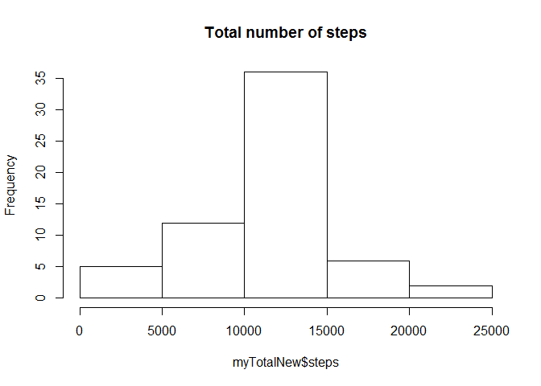

# Reproducible Research: Peer Assessment 1

##Reproducible Research first assignment

##1. Read in the data

The zip file with the dataset is extracted into the home directory and then read in


##2. What is the mean total number of steps taken each day?

Reshape the dataset to get the total numbers of steps per day

```r
myMelt <- melt(activity, id = "date")
myTotal <- dcast(myMelt, date ~ variable, sum)
```

Create the histeogram of total numbers of steps taken each day
plot of chunk unnamed-chunk-4

```r
hist(myTotal$steps, main = "Total number of steps")
```

 

Calculate the the mean and median of total numbers of steps taken each day, NAs need to be removed as otherwise the mean and median are NA

```r
mean(myTotal$steps, na.rm = TRUE)
```

```
## [1] 10766.19
```

```r
median(myTotal$steps, na.rm = TRUE)
```

```
## [1] 10765
```

##3. What is the average daily activity pattern?
Reshape the data to get the mean for each interval

```r
myMelt <- melt(activity, id = "interval", na.rm = TRUE)
```

```
## Warning: attributes are not identical across measure variables; they will
## be dropped
```

```r
myInterval <- dcast(myMelt, interval ~ variable, mean)
```

Create a time series plot of the means for each interval
plot of chunk unnamed-chunk-7

```r
plot(myInterval$interval, myInterval$steps, type = "l")
```

 

Calculate the interval with the maximum average of steps


```r
myInterval[myInterval$steps == max(myInterval$steps), 1]
```

```
## [1] 835
```

##4. Imputing missing values

Computing the number of missing cases

```r
nrow(activity[!complete.cases(activity), ])
```

```
## [1] 2304
```

Creating a new dataset in which the missing values for steps are replaced with the mean of the respective interval


```r
x <- rep(myInterval$steps, 61)
activityNew <- activity
activityNew$steps[is.na(activityNew$steps)] <- x[is.na(activityNew$steps)]
```

Reshape the new dataset to get the total numbers of steps per day


```r
myMeltNew <- melt(activityNew, id = "date")
myTotalNew <- dcast(myMeltNew, date ~ variable, sum)
```

Creating the histeogram for the new dataset
plot of chunk unnamed-chunk-12


```r
hist(myTotalNew$steps, main = "Total number of steps")
```

 


Calculating mean and median for the new dataset


```r
mean(myTotalNew$steps)
```

```
## [1] 10766.19
```

```r
median(myTotalNew$steps)
```

```
## [1] 10766.19
```

##5. Are there differences in activity patterns between weekdays and weekends?

Creating an new factor variable called 'Days' with the levels weekday and weekend


```r
x <- as.factor(weekdays(activityNew$date))
levels(x) <- list(Weekday = "Friday", Weekday = "Monday", Weekend = "Saturday",
    Weekend = "Sunday", Weekday = "Thursday", Weekday = "Tuesday", Weekday = "Wednesday")
activityNew$Days <- x
```

Preparing the dataset to create a time series plot of the means for each interval for both weekend and weekday by subsetting and reshaping


